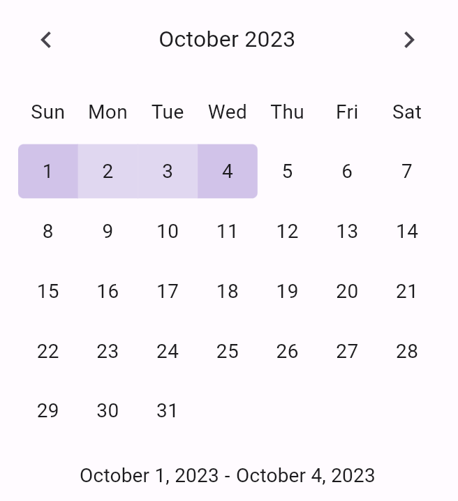

# SimpleDateRangePicker

A simple, stylish `DateTimeRange` picker component for Flutter.

## Features

* In-line widget for selecting a range of dates (`DateTimeRange`)
* `showSimpleDateRangePickerDialog` method to easily display the picker in a dialog



## Getting started

Install the package by adding the following to your `pubspec.yaml` file:

```yaml
dependencies:
  simple_date_range_picker: ^0.0.2
```

## Usage

Import the package into your project:

```dart
import 'package:simple_date_range_picker/simple_date_range_picker.dart';
```

Use the `SimpleDateRangePicker` widget to display the picker as an in-line widget:

```dart
SimpleDateRangePicker(
  onChanged: (dateRange) => setState(() => selectedDates = dateRange),
),
```

Or, use `showSimpleDateRangePickerDialog` to display the picker as a modal dialog:

```dart
final dateRange = await showSimpleDateRangePickerDialog(context);
```

## Roadmap

Additional features planned for the future include:

* Customizable colors, borders, and TextStyles for the picker
* Customizable colors, border, TextStyles, and buttons for the dialog
* Date validation - determine which dates are selectable
* Custom initial month view - specify which month to display first
